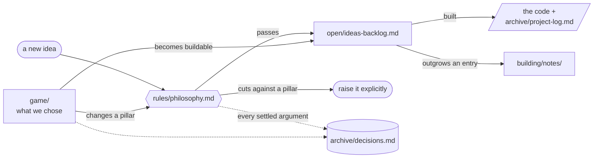

# Documentation

Sorted by **how much it binds you**, not by topic. The further down this
page, the less it constrains what you do next.

| | Folder | Read it when |
|---|---|---|
| 1 | **[game/](game/README.md)** | You need to know what this game *is*. Settled. |
| 2 | **[rules/](rules/philosophy.md)** | You are about to write something and must not contradict it. Binding. |
| 3 | **[building/](building/development.md)** | You are working on it right now. |
| 4 | **[open/](open/ideas-backlog.md)** | You are looking for what to do next. Nothing here is decided. |
| 5 | **[archive/](archive/project-log.md)** | You are asking *why* something ended up this way. Never required. |

## If you read one thing

**[game/one-page.en.md](game/one-page.en.md)** — the whole design as a single
annotated image: the curvature axis and the cliff in it, the ten spaces with
their figures, the seven verbs, the antagonist, the four threads and the
three endings. Built to be looked at rather than read, and to be printed and
pinned up. Everything below expands one part of it.
Also in French: **[game/one-page.fr.md](game/one-page.fr.md)**.

**[game/README.md](game/README.md)** — the premise, the pillars, the pitch,
in prose.

---

## 1. game — what we chose

The whole-game direction. Nine of its ten spaces have geometry you can walk;
three of them have the mechanic that geometry exists for. The Garden has
neither, and the Garden is the endgame — the one-pager carries the per-space
breakdown.

| File | Holds |
|---|---|
| [one-page.en.md](game/one-page.en.md) | **The whole design on one page**, as a diagram — start here |
| [one-page.fr.md](game/one-page.fr.md) | The same page in French — the two are one design, changed together |
| [README.md](game/README.md) | The premise, the pillars, the pitch, in prose |
| [story.md](game/story.md) | Garden of Eden: the chosen storyline |
| [world.md](game/world.md) | The ten spaces: what each *is*, teaches, and looks like |
| [systems.md](game/systems.md) | The verbs, and how knowledge gates progress without a journal |
| [first-hour.md](game/first-hour.md) | The opening hour, beat by beat, with nothing explained |
| [mathematics.md](game/mathematics.md) | Every geometric and automaton idea the game uses, with figures |
| [art-and-audio.md](game/art-and-audio.md) | Art and audio direction, written as briefs |
| [names.md](game/names.md) | The game is not called unbegotten any more. Candidates |
| [inspirations.md](game/inspirations.md) | External references, and the specific lesson each carries |
| [one-page/](game/one-page/README.md) | How the one-pager's figures are computed. Optional — the SVGs stand alone |

## 2. rules — what we must respect

Contradicting anything here is a decision to raise explicitly, not a
thing to do quietly.

| File | Holds |
|---|---|
| [philosophy.md](rules/philosophy.md) | The design pillars |
| [guidelines.md](rules/guidelines.md) | Engineering conventions, in full. [`../CLAUDE.md`](../CLAUDE.md) is the short version |
| [architecture.md](rules/architecture.md) | How the spatial core represents curvature, and the engine decision |

## 3. building — how to work on it

| File | Holds |
|---|---|
| [development.md](building/development.md) | Setup, the build, the verification loop |
| [roadmap.md](building/roadmap.md) | Phases, honest timeline, risk register |
| [notes/](building/notes/) | One engineering note per file, for anything that outgrew a backlog entry |

## 4. open — not settled

| File | Holds |
|---|---|
| [ideas-backlog.md](open/ideas-backlog.md) | Ideas not built yet, each checked against the pillars first |
| [bug-tracker.md](open/bug-tracker.md) | Known bugs not yet fixed |
| [assets/](open/assets/README.md) | Diagrams for the backlog, and how to redraw them |

## 5. archive — why things are the way they are

Never required reading. Consulted when a decision looks strange and you
want to know what it replaced.

| File | Holds |
|---|---|
| [project-log.md](archive/project-log.md) | Chronological history: what was built, what broke, what it cost |
| [decisions.md](archive/decisions.md) | Decision records — what was chosen, what was rejected, and why |
| [changelog.md](archive/changelog.md) | Bugs that have been fixed |
| [forsaken-storylines/](archive/forsaken-storylines/) | The two stories that lost to Garden of Eden |
| [one-page/](archive/one-page/README.md) | Superseded editions of the one-page design, kept verbatim |

---

## How things move between these

Two rules worth stating outright:

- **An idea that cuts against a pillar is a reason to raise it**, not to
  add it quietly.
- **When something ships, delete its backlog entry.** The code plus the
  project log is the record from then on; keep only whatever part is
  still open.
