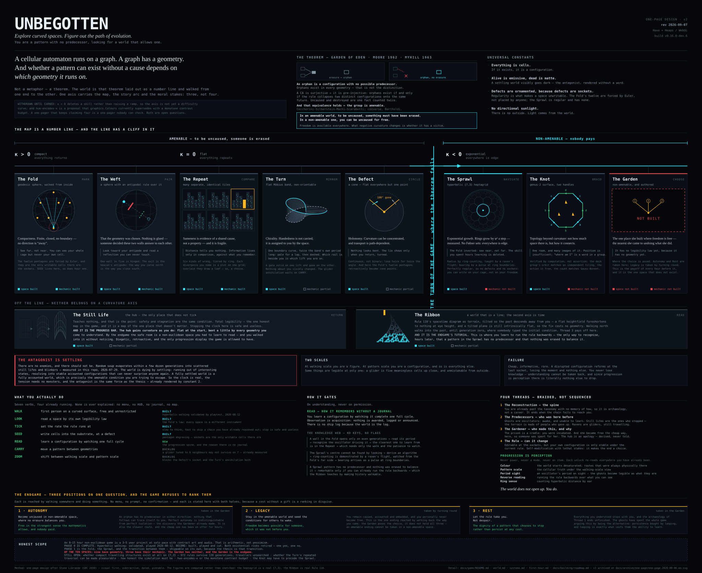

# The curvature line — one-page design (English)

---

## What this is, and why it exists

A **one-page design**, in the sense [Stone Librande](https://gdcvault.com/play/1012356/One-Page)
meant at GDC 2010: not a shorter document, but a *visual* one — a single
annotated image that fits on one page, is dated, and is worth pinning to a
wall.

His diagnosis was about readership rather than length. Long design bibles
go unread, and wikis break the **relationships** between elements, which is
what a design mostly consists of. That diagnosis lands here: [`docs/`](README.md)
is around 3,500 lines across sixteen files, [`world.md`](world.md) alone is
over 800, and all of it is good — which is exactly the artefact he was
describing.

So this page is **subtractive**. The rule is his: *what is the single most
important thing I really need to communicate?* For this project that is not
in doubt, and it is already the first line of `world.md` — **the world is a
number line**. Everything on the page annotates that spine. Anything that
did not was cut.

## What changed in v2

v1 is kept, unaltered, at
[../archive/one-page/one-page.2026-09-06.en.svg](../archive/one-page/one-page.2026-09-06.en.svg).
It was a good statement of *theme* and a poor statement of *design*, and the
six changes below are what closed that gap. Five of them are promotions:
the content was already in `docs/`, just not on the page.

- **It has figures now.** v1 cited Librande's *visual first* rule in its own
  footer and then contained no drawing at all — 145 text nodes, and every
  rectangle was a box or a bar. A reader had to already know what a
  heptagrid looked like in order to read the page about it. There are now
  ten figures, and they are **computed rather than sketched** (see
  [one-page/](one-page/README.md)): the Sprawl is a real `{7,3}` in the
  Poincaré disk, the Ribbon is real Rule 110, the Turn is a real Möbius
  parametrisation.

- **The cliff is the dominant graphic.** The map is a number line, but the
  thing that actually matters — amenable vs. non-amenable — is a *threshold*,
  not a slope, and κ > 0 and κ = 0 carry the same moral content. v1 said so
  in 10px grey type pointing off the right edge. It is now a full-height
  break in the axis with the two regimes bracketed either side of it, which
  is also why the κ > 0 column no longer has to pretend to be as full as the
  others.

- **The loop is on the page.** v1 gave each space a one-word verb and never
  said what a minute of play consists of. The seven verbs from
  [systems.md](systems.md) are now here with their build state, along with
  the two scales, and **the antagonist** — the settling world — which was
  the largest omission: v1 carried it as an art-direction constant (*alive
  is emissive, dead is matte*) without ever saying it was the pressure.

- **Gating is explained rather than asserted.** "Gates on understanding,
  never on permission" is a claim about the hardest problem in the project.
  `READ` and the three worked chains of the knowledge web now say how.

- **Build state is split into *space* and *mechanic*.** One chip could not
  distinguish "the geometry runs" from "the thing the geometry exists for
  exists", which is exactly the distinction that matters for six of the ten.
  The Garden's figure is an empty dashed frame, because that is the honest
  drawing of a space that does not exist, and the honest-scope band at the
  foot says the same thing in numbers.

- **The four-in-one claim is now three.** v1 asserted the axis was
  simultaneously the map, the difficulty curve, the story arc and the art
  direction. Two of those do not currently hold: κ < 0 *deletes* a skill
  rather than raising a ramp, and hue-encodes-κ is a proposal that
  [`graphics.Colours`](../../src/graphics/Colours.hx) supersedes for now with
  a monotone contrast budget (see [art-and-audio.md](art-and-audio.md)'s own
  status box). Both are named as open rather than quietly kept.

One design question was *resolved* rather than promoted, and it is flagged
here because it changes `world.md`: that file's Garden entry says "where the
three endings live", but ending 2 requires staying in the **amenable** world,
so it cannot be taken in a non-amenable space. The page now reads: the Garden
**poses** the choice; Autonomy and Rest are taken there, and **Legacy is
taken by turning round**. That is a better ending anyway — the one you reach
by walking back the way you came — but it is a change, not a transcription.

## How to read it

- **Horizontally is curvature**, κ > 0 on the left to κ < 0 on the right.
  That is also the play order and the emotional arc.
- **The cliff between the Defect and the Sprawl is where the theorem fails.**
  Everything left of it is amenable and freedom costs a predecessor;
  everything right of it is not, and nobody pays.
- **The Still Life and the Ribbon sit off the line** — one is the hub, one is
  a space whose second axis is time, and neither belongs on a curvature axis.
  Both are load-bearing anyway: the hub is the progress bar, and the Ribbon
  is the endgame's tutorial.
- **Each space carries its own legibility law**, in the boxed line. No two are
  the same instrument; that is the point of having ten.
- **Build state is on every card, twice**, because a design document that
  quietly implied the Garden exists would be the failure mode this format is
  meant to cure.

## Conventions

The palette is taken from [`graphics.Colours`](../../src/graphics/Colours.hx)
rather than invented: the value ramp carries all structure, and the four
signal colours are spent on one meaning each, as the palette's own contrast
budget requires — `SIGNAL_LIVE` on what runs (the non-amenable side, and
*built*), `SIGNAL_ACT` on what the player can do (the verbs), `SIGNAL_DENY`
on what refuses (*not built*, and the settling), `SIGNAL_MARK` on what is
worth crossing a space for (the Garden, and the three endings).

`one-page.en.svg` is plain SVG with presentation attributes only — no
`<style>`, no scripts, no webfonts, no `<defs>`, no external references — so
GitHub renders it intact in both the file view and this page, `outline-sync`
can carry it into Outline, and it prints as vector at any size. It is text,
so it diffs like code.

It is **2688 × 2196**, sized for A1/A2 landscape with roughly a 6% margin.
That is deliberately larger than v1's 1600 × 1850: v1's 11px body type is
about 2mm at A3, which is a screen document calling itself pinnable.

A French edition is kept alongside it at [one-page.fr.md](one-page.fr.md);
the two are the same design and have to be changed together.

**Date it when you change it.** The revision stamp is top-right, and it is
Librande's rule rather than a flourish: a one-pager on a wall is worthless if
nobody can tell which version they are looking at.
