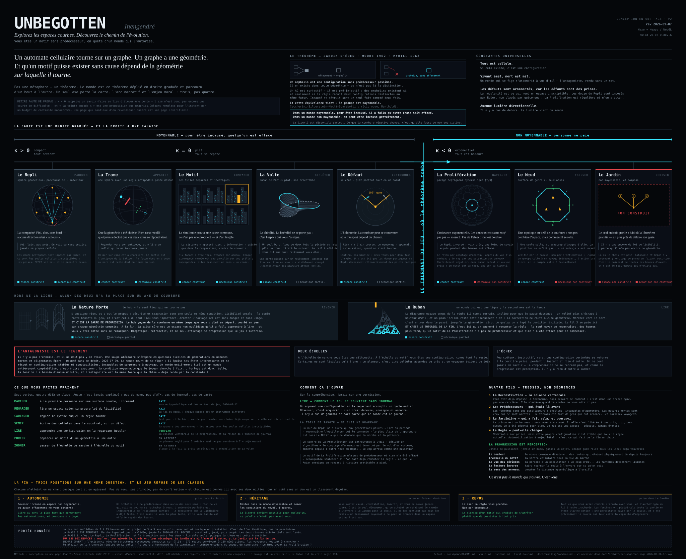

# La ligne de courbure — conception en une page (français)

---

## Ce que c'est, et pourquoi

Une **conception en une page**, au sens où [Stone Librande](https://gdcvault.com/play/1012356/One-Page)
l'entendait à la GDC 2010 : non pas un document plus court, mais un document
*visuel* — une seule image annotée qui tient sur une page, qui est datée, et
qu'on a envie d'afficher au mur.

Son diagnostic portait sur la lecture, pas sur la longueur. Les gros
documents de conception ne sont pas lus, et les wikis cassent les
**relations** entre les éléments — or une conception est surtout faite de
relations. Le diagnostic s'applique ici : [`docs/`](README.md) fait environ
3 500 lignes réparties sur seize fichiers, [`world.md`](world.md) en fait
plus de 800 à lui seul, et tout cela est bon — c'est exactement l'objet
qu'il décrivait.

Cette page est donc **soustractive**, selon sa règle : *quelle est la seule
chose vraiment essentielle à communiquer ?* Ici, la réponse ne fait pas de
doute, et c'est déjà la première ligne de `world.md` — **le monde est une
droite graduée**, et cet axe unique est à la fois la carte, la courbe de
difficulté, l'arc narratif et la direction artistique. Tout le reste de la
page annote cette colonne vertébrale. Ce qui ne le faisait pas a été coupé.

## Comment la lire

- **L'horizontale est la courbure**, de κ > 0 à gauche vers κ < 0 à droite.
  C'est aussi l'ordre de jeu, la courbe de difficulté et l'arc émotionnel.
- **La Nature Morte et Le Ruban sont hors de la ligne** — l'un est le hub,
  l'autre un espace dont le second axe est le temps, et aucun n'a sa place
  sur un axe de courbure.
- **Chaque espace porte sa propre loi de lisibilité**, dans l'encadré. Aucune
  ne se ressemble ; c'est tout l'intérêt d'en avoir neuf.
- **L'état de construction figure sur chaque carte**, parce qu'un document
  qui laisserait croire que Le Jardin existe serait précisément le travers
  que ce format sert à corriger.

## Conventions

La palette vient de [`graphics.Colours`](../../src/graphics/Colours.hx) et
n'a pas été inventée : la rampe de valeurs porte toute la structure, et les
quatre couleurs de signal ne servent qu'aux quatre fils. C'est le budget de
contraste du jeu appliqué à un document — et la courbure est encodée par la
*valeur*, s'assombrissant de gauche à droite, ce qui est d'ailleurs
simplement vrai de la lumière dans L'Étalement.

`one-page.fr.svg` est du SVG simple, attributs de présentation uniquement —
pas de `<style>`, pas de script, pas de police web, aucune référence externe
— pour que GitHub le rende intact, que `outline-sync` puisse le reprendre, et
qu'il s'imprime en vectoriel à n'importe quelle taille. C'est du texte : il
se diffe comme du code.

## Les noms

Les noms d'espaces ne sont pas des calques : l'anglais fait presque toujours
un double sens, et le français doit en faire un aussi. **La Trame** garde le
tissage *et* la trame narrative ; **Le Repli** garde le pli géométrique *et*
l'abri où l'on se replie, qui est tout le sujet du Fil 3 ; **Le Motif** dit
le motif répété *et* la cause, qui est exactement la leçon de cet espace ;
**Le Nœud** dit le nœud topologique *et* le nœud dramatique ; **La Nature
Morte** est le terme français consacré du jeu de la vie, et dit « nature
morte » pour le seul lieu qui ne tourne pas.

Le vocabulaire technique suit les termes français réels — *moyennable* pour
*amenable*, *nature morte* pour *still life*, *planeur* pour *glider* — et
non des anglicismes.

**Encore ouverts :** *La Volte* (The Turn) et *Le Foisonnement* (The Sprawl)
sont des titres de travail. *La Volte* dit le demi-tour d'escrime et de manège,
d'où vient *volte-face* — juste de sens, mais soudain, là où le retournement
möbien est graduel et se produit sans qu'on le remarque. *Le Défaut* et *Le Ruban* aussi, plus faiblement :
*La Faille* dirait mieux le défaut mais évoque une fissure linéaire là où il
s'agit d'un point, et *La Frise* dirait la ligne du temps si cet espace la
rendait un jour visible.

Le sous-titre **Inengendré** ne figure que sur l'édition française : c'est le
terme nicéen exact, le même emprunt théologique que l'anglais *unbegotten*.

L'édition anglaise est à côté, dans [one-page.en.md](one-page.en.md) ; les
deux sont la même conception et doivent être modifiées ensemble.

**Datez-la quand vous la changez.** Le tampon de révision est en haut à
droite, et c'est la règle de Librande plutôt qu'une coquetterie : une page
affichée au mur ne vaut rien si personne ne peut dire quelle version il
regarde.
