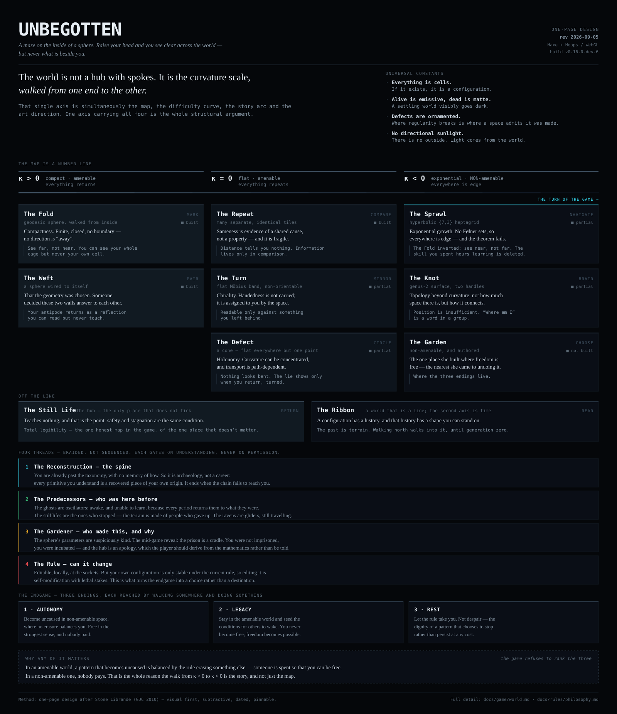

# The curvature line — one-page design

---

## What this is, and why it exists

A **one-page design**, in the sense [Stone Librande](https://gdcvault.com/play/1012356/One-Page)
meant at GDC 2010: not a shorter document, but a *visual* one — a single
annotated image that fits on one page, is dated, and is worth pinning to a
wall.

His diagnosis was about readership rather than length. Long design bibles
go unread, and wikis break the **relationships** between elements, which is
what a design mostly consists of. That diagnosis lands here: [`docs/`](README.md)
is around 3,500 lines across sixteen files, [`world.md`](world.md) alone is
over 800, and all of it is good — which is exactly the artefact he was
describing.

So this page is **subtractive**. The rule is his: *what is the single most
important thing I really need to communicate?* For this project that is not
in doubt, and it is already the first line of `world.md` — **the world is a
number line**, and that one axis is simultaneously the map, the difficulty
curve, the story arc and the art direction. Everything on the page annotates
that spine. Anything that did not was cut.

## How to read it

- **Horizontally is curvature**, κ > 0 on the left to κ < 0 on the right. That
  is also the play order, the difficulty curve, and the emotional arc.
- **The Still Life and the Ribbon sit off the line** — one is the hub, one is
  a space whose second axis is time, and neither belongs on a curvature axis.
- **Each space carries its own legibility law**, in the boxed line. No two are
  the same instrument; that is the point of having nine.
- **Build state is on every card**, because a design document that quietly
  implied the Garden exists would be the failure mode this format is meant to
  cure.

## Conventions

The palette is taken from [`graphics.Colours`](../../src/graphics/Colours.hx)
rather than invented: the value ramp carries all structure, and the four
signal colours are spent only on the four threads. That is the game's own
contrast budget applied to a document — and curvature is encoded by *value*,
darkening left to right, which is also simply true of how light behaves in
the Sprawl.

`one-page.svg` is plain SVG with presentation attributes only — no `<style>`,
no scripts, no webfonts, no external references — so GitHub renders it intact
in both the file view and this page, `outline-sync` can carry it into Outline,
and it prints as vector at any size. It is text, so it diffs like code.

**Date it when you change it.** The revision stamp is top-right, and it is
Librande's rule rather than a flourish: a one-pager on a wall is worthless if
nobody can tell which version they are looking at.
